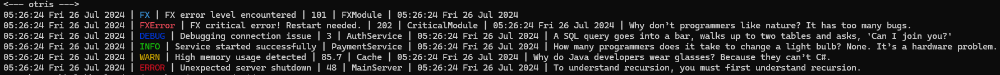

# otris
otris is pretty logger, extension for the slog library, developed as part of the Open-Streaming-Solutions project.

## Showcase
```shell
<--- otris --->
05:26:24 Fri 26 Jul 2024 | FX | FX error level encountered | 101 | FXModule | 05:26:24 Fri 26 Jul 2024
05:26:24 Fri 26 Jul 2024 | FXError | FX critical error! Restart needed. | 202 | CriticalModule | 05:26:24 Fri 26 Jul 2024 | Why don’t programmers like nature? It has too many bugs.
05:26:24 Fri 26 Jul 2024 | DEBUG | Debugging connection issue | 3 | AuthService | 05:26:24 Fri 26 Jul 2024 | A SQL query goes into a bar, walks up to two tables and asks, 'Can I join you?'
05:26:24 Fri 26 Jul 2024 | INFO | Service started successfully | PaymentService | 05:26:24 Fri 26 Jul 2024 | How many programmers does it take to change a light bulb? None. It’s a hardware problem.
05:26:24 Fri 26 Jul 2024 | WARN | High memory usage detected | 85.7 | Cache | 05:26:24 Fri 26 Jul 2024 | Why do Java developers wear glasses? Because they can’t C#.
05:26:24 Fri 26 Jul 2024 | ERROR | Unexpected server shutdown | 48 | MainServer | 05:26:24 Fri 26 Jul 2024 | To understand recursion, you must first understand recursion.
```

